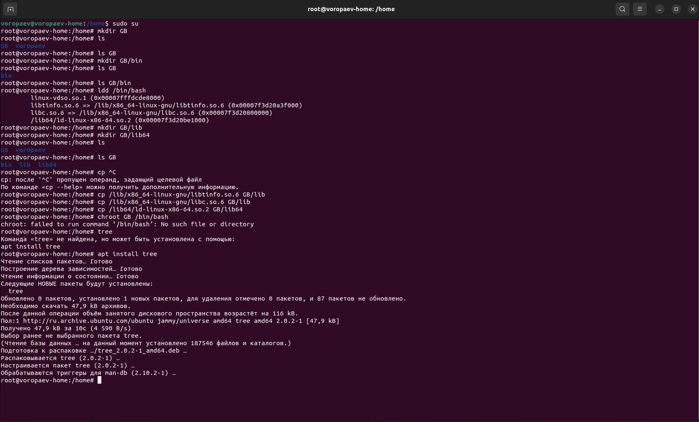
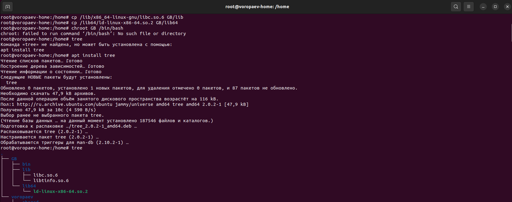
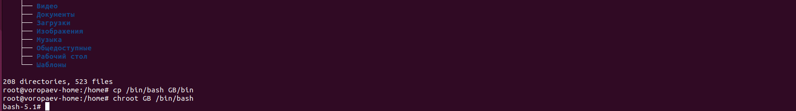
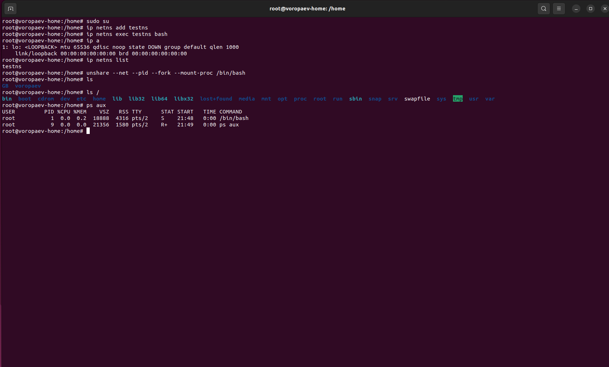

## Урок 1. Механизмы пространства имен ##

### Задание: необходимо продемонстрировать изоляцию одного и того же приложения (как решено на семинаре - командного интерпретатора) в различных пространствах имен.

##### Формат сдачи ДЗ: предоставить доказательства выполнения задания посредством ссылки на google-документ с правами на комментирование/редактирование.
##### Результатом работы будет: текст объяснения, логи выполнения, история команд и скриншоты (важно придерживаться такой последовательности).В названии работы должны быть указаны ФИ, номер группы и номер урока.
***


## Решение

### Смена корневой директории

Все команды выполняем под root правами, для этого вводим

```sudo -s```


Создаём папку для нашей новой корневой директории.

```mkdir GB```

Копируем в неё bash.

```cp /bin/bash GB/bin```



Подгружаем зависимости. Список зависимостей можно вывести командой.

```ldd /bin/bash```



Результат

linux-vdso.so.1 (0x00007fff1b3eb000)
	libtinfo.so.6 => /lib/x86_64-linux-gnu/libtinfo.so.6 (0x00007f4d5f67a000)
	libc.so.6 => /lib/x86_64-linux-gnu/libc.so.6 (0x00007f4d5f400000)
	/lib64/ld-linux-x86-64.so.2 (0x00007f4d5f81c000)``


Меняем директорию

```chroot GB /bin/bash```




### Сетевое пространство имен

Создаем новую папку для сетевого пространства

```ip netns add testns```

создаем пространство

```ip netns exec testns bash```

и выводим ip этого пространства

```ip a```

Создаём пространство имён через unshare,в параметры unshare передаём то что мы хотим изолировать

```unshare --net --pid --fork --mount-proc /bin/bash```



