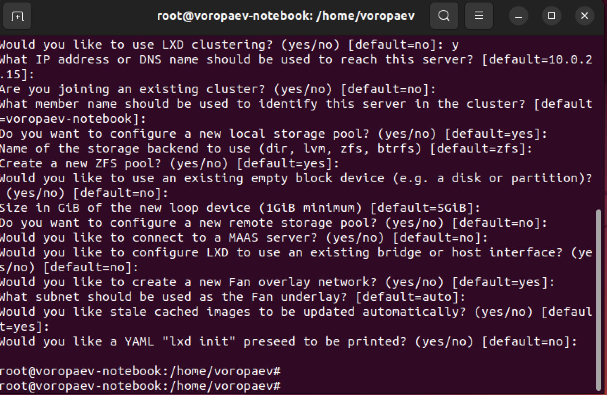
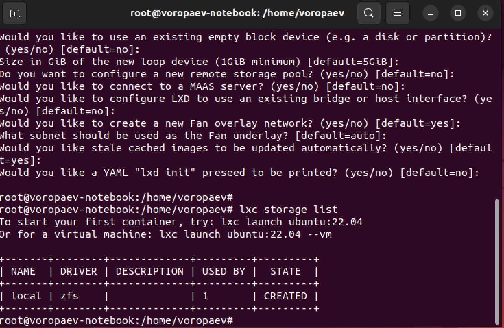
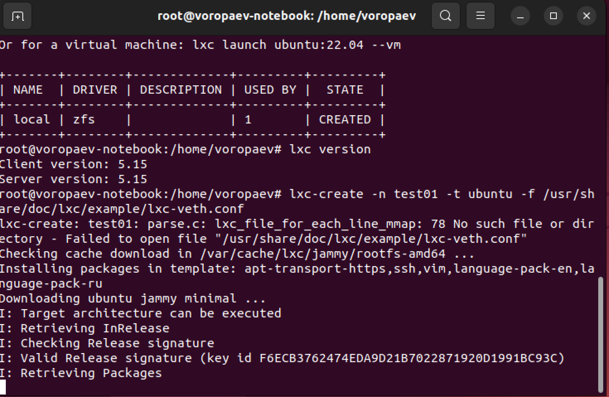
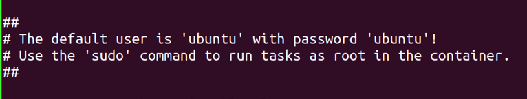
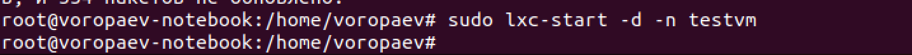
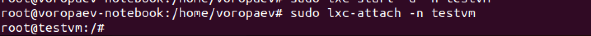
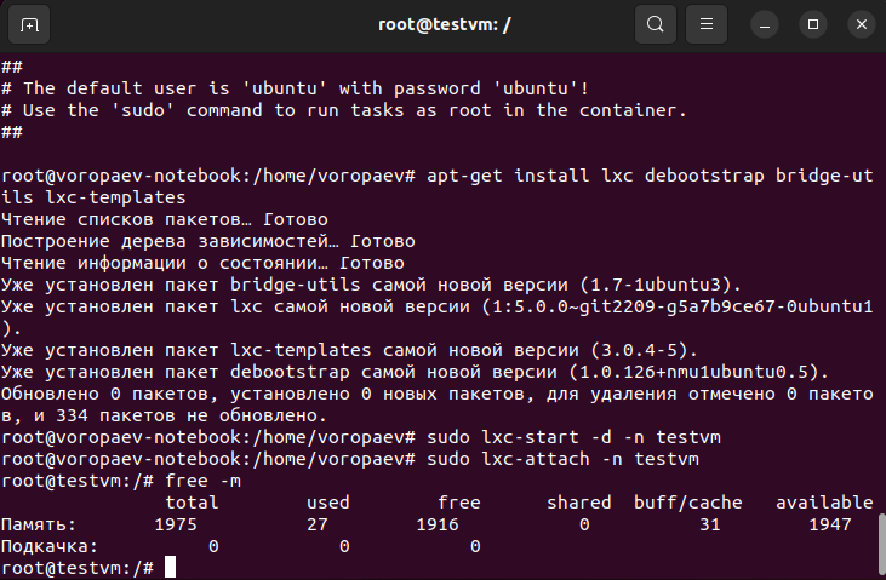
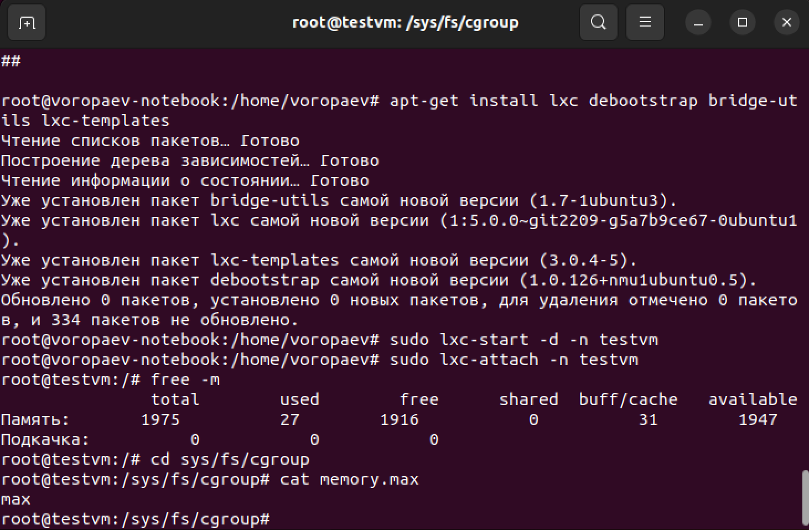
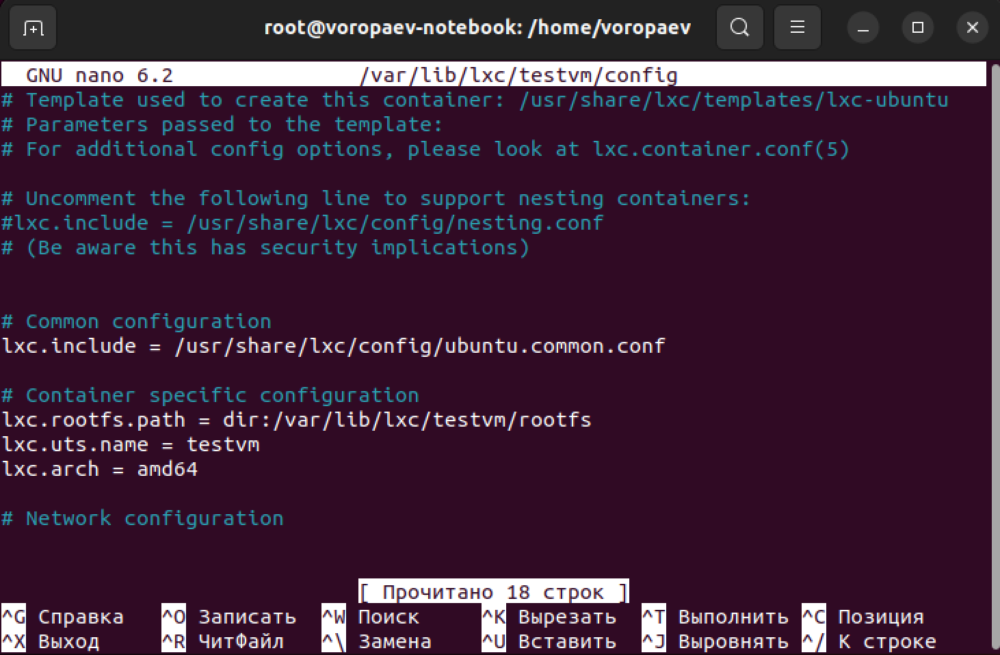
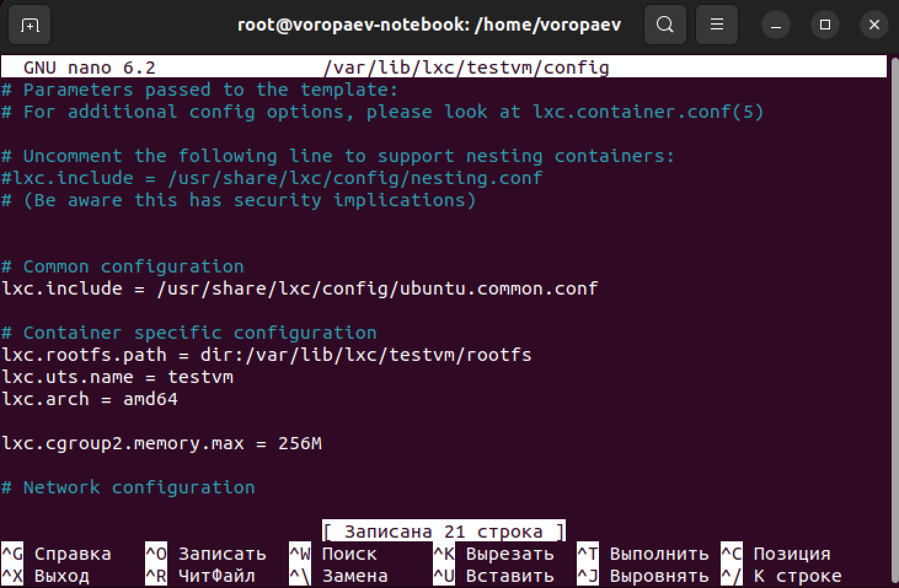

## Урок 2. Механизмы контрольных групп ##

### Задание 1:
1) запустить контейнер с ubuntu, используя механизм LXC
2) ограничить контейнер 256 Мб ОЗУ и проверить, что ограничение работает
3) По желанию
4) Добавить автозапуск контейнеру, перезагрузить ОС и убедиться, что контейнер действительно запустился самостоятельн
5) при создании указать файл, куда записывать логи
6) после перезагрузки проанализировать логи ###
***


## Решение

### Установим LXC и шаблоны:


```apt-get install lxc debootstrap bridge-utils lxc-templates```

```apt-get install lxd-installer```

После успешной установки видим, что для начала необходимо инициализировать LXD на машине. Вводим команду:


```lxd init```



Проверяем

```lxc storage list```




После инициализации снова убеждаемся, что все нормально установлено, путем проверки версии LXC:

```lxc version```

И создаем контейнер:

```lxc-create -n testvm -t ubuntu -f /usr/share/doc/lxc/example/lxc-veth.conf```
```apt-get install lxc debootstrap bridge-utils lxc-templates```
```lapt-get install lxd-installer```

Видим большое количество текста, значит команда введена правильно. В тексте указана ошибка открытия файла конфигурации указанного нами. На запуск контейнера это не повлияет, а случается из-за того, что такого файла на данном этапе не существует.




После того, как контейнер установился система оповещает нас о том, что контейнер создан, у него заданы стандартные параметры (логин: ubuntu, пароль: ubuntu).



Теперь необходимо запустить созданный нами контейнер. Для этого вводим следующую команду:

```sudo lxc-start -d -n testvm```




Если ситема никак не оповестила нас ни о чем, значит команда успешно выполнена. Проверить это можно, например, путем входа в контейнер:

```sudo lxc-attach -n testvm```

Мы зашли под root



Вводим 

```free -m```

для просмотра выделенной и свободной памяти




Ограничение памяти установлено на максимальное значение




Выходим из контейнера

```exit```

Открываем через редактор nano

```nano /var/lib/lxc/test123/config-открываем```



Записываем и сохраняем

```lxc.cgroup2.memory.max = 256M```



Проверяем

```sudo cat /sys/fs/cgroup/lxc.cgroup2.testvm/memory.max```