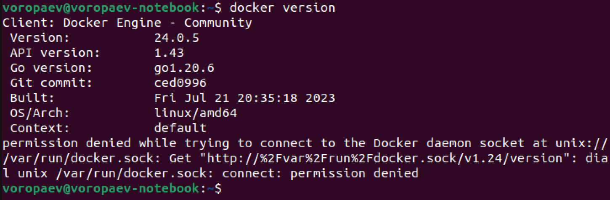

## Урок 3.  Введение в Docker ##

### Задание 1:
1) запустить контейнер с БД, отличной от mariaDB, используя инструкции на сайте: https://hub.docker.com/ 
2) добавить в контейнер hostname такой же, как hostname системы через переменную
3) заполнить БД данными через консоль
4) запустить phpmyadmin (в контейнере) и через веб проверить, что все введенные данные доступны ###
***


## Решение

Убедимся, что Docker установлен и работает корректно, выполнив команду 

```docker version```



Подключимся к Docker Hub, используя команду 

```docker login``` 

и введем свои учетные данные.


Найдем нужный образ базы данных на Docker Hub. Например, для PostgreSQL можно воспользоваться командой 

```docker search postgres```


Выберем образ, который нам подходит, и скопируем его название и тег. Запуститим контейнер с базой данных, используя команду "docker run" с параметрами, указывающими имя образа, порт привязки и другие настройки. Например:

```docker run --name my-mysql -e MYSQL_ROOT_PASSWORD=mysecretpassword -e HOSTNAME=$(hostname) -d mysql```

Это запустит контейнер с именем "my-mysql" и настроит переменную окружения "PMYSQL_ROOT_PASSWORD" со значением "mysecretpassword". 
Дождемся, пока контейнер запустится, и проверим его статус с помощью команды 

```docker ps```


Подключение phpmyadmin к нашему контейнеру с mysql

Скачаем последний образ PHPMyAdmin с Docker Hub

```docker pull phpmyadmin/phpmyadmin```

Запустим контейнер PHPMyAdmin

```docker run --name my-phpmyadmin -d --link my-mysql:db -p 8080:80 phpmyadmin/phpmyadmin```

Откроем веб-браузер и перейдем по адресу `http://localhost:8080`, чтобы получить доступ к PHPMyAdmin, где можно проверить введенные данные в базу данных.


