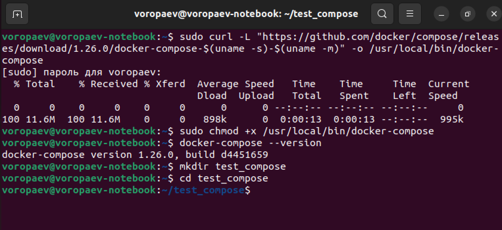
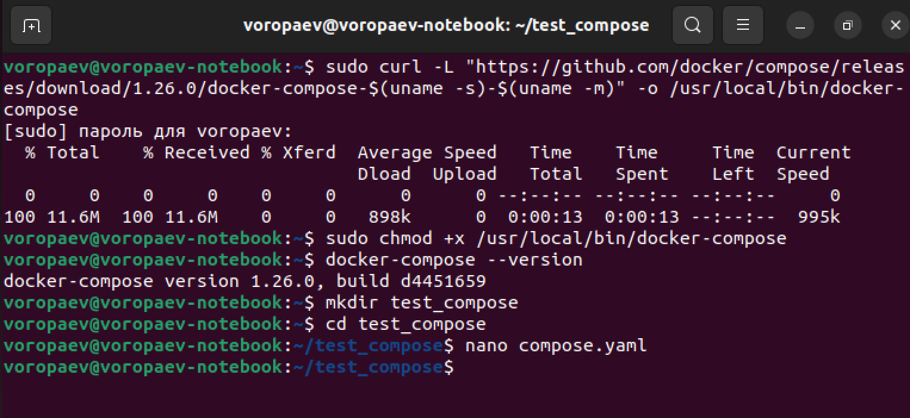
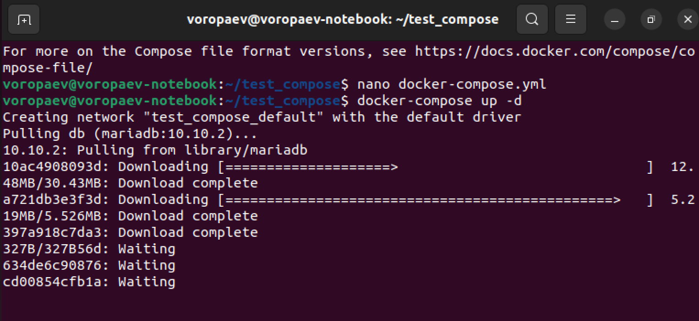
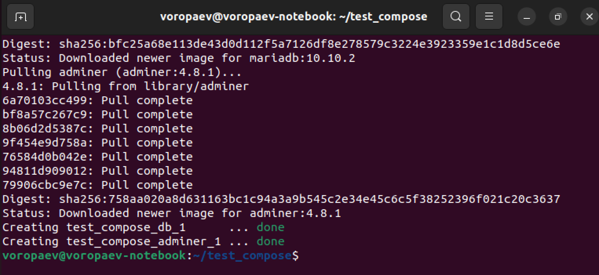
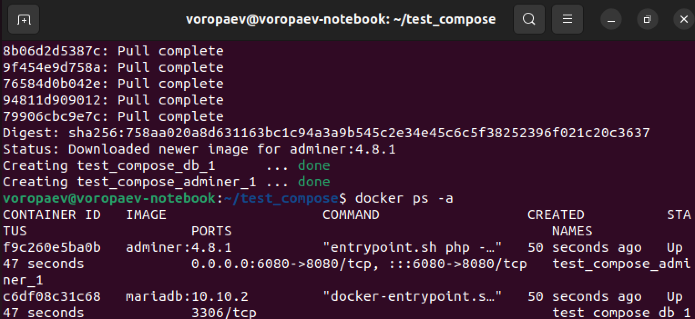

## Урок 5. Docker Compose и Docker Swarm ##

### Задание 1:
1) создать сервис, состоящий из 2 различных контейнеров: 1 - веб, 2 - БД (compose)
Задание со звездочкой - повышенной сложности..
** не обязательно 2) необходимо создать 3 сервиса в каждом окружении (dev, prod, lab)
** не обязательно 3) по итогу на каждой ноде должно быть по 2 работающих контейнера
4) выводы зафиксировать ###
***

## Решение

Создаём директорию для нашего проекта

```mkdir test_compose```

И сразу перейдём в нее

```cd test_compose```



Создадим yaml фаил

```nano compose.yaml```

и заполняем его

```version: '3.3'


services:


  db:

    image: mariadb:10.10.2

    restart: always

    environment:

      MYSQL_ROOT_PASSWORD: 12345


  adminer:

    image: adminer:4.8.1

    restart: always

    ports:

      - 6080:8080```



В этом файле мы определяем два сервиса: `web` и `db`. Сервис `web` будет использовать `Dockerfile` из папки `./web` для построения контейнера, а сервис `db` будет использовать `Dockerfile` из папки `./db` для построения контейнера базы данных.

Мы также определяем порт `8000:80`, чтобы маппить порт 8000 хоста на порт 80 контейнера веб-приложения. Опция `depends_on` позволяет дождаться запуска сервиса базы данных перед запуском веб-сервиса.

Запускаем сборку контейнеров

```docker-compose up -d```







проверяем контейнеры

```docker ps -a```



Все работает :)


